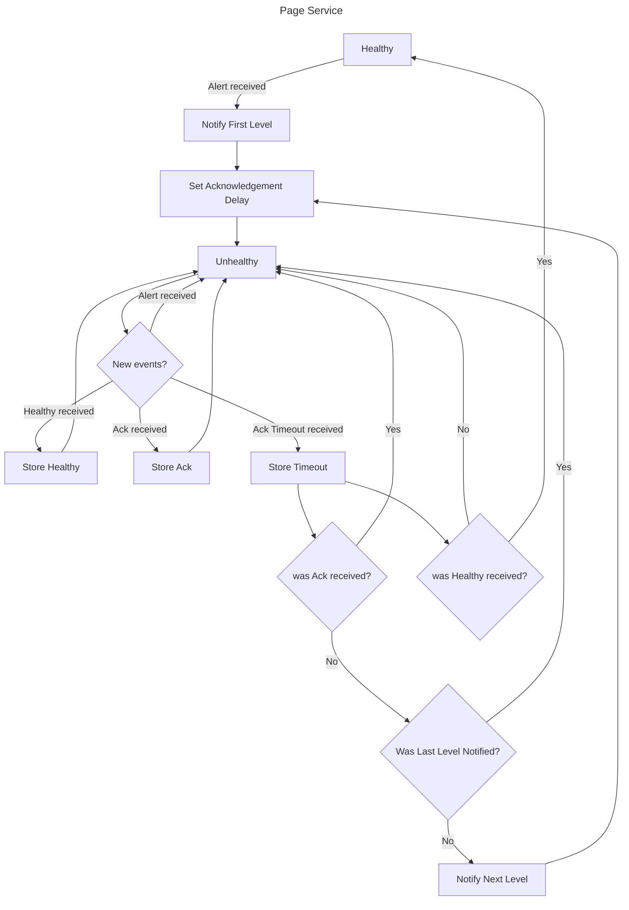

# Instructions how to build the project

1. Install Make
2. Install Python 3.12.2. Example, first install `pyenv`, then:
    ```bash
    pyenv install 3.12.2
    $(pyenv which python3.12) -m venv .venv
    ```
3. Install poetry. Example:
   ```bash
    source .venv/bin/activate
    pip install --upgrade pip
    pip install poetry
    poetry install
    ```

## Instructions how to run unit tests

```bash
$ make test
```

## Implementation

https://github.com/aircall/technical-test-pager
Aircall Technical Test - Aircall Pager

### Flow diagram for a Page Service



## Decisions

### Architecture design pattern

#### OOP Pager Service

In the Pager Service the exercise mentions adapters and domain, it suggests applying
a [hexagonal architecture](https://alistair.cockburn.us/hexagonal-architecture/).

The arrows that goes into Pager Service are the `incoming ports`, and the arrows that goes out of Pager Service are
the `outcoming ports` (infrastructure).


Each [use_cases](app/application/use_cases) triggers a [domain Service](app/domain/services) to handle:

1. The `Alert`
2. The events:
    * `Ack`
    * `Timeout`
    * `Healthy`

The `outcoming ports` are injected as dependencies.

#### Communication

The communication between services (Pager, Web Console, Escalation Policy, Alerting, Mail, SMS and Timer) suggests a
microservices' architecture.

The implementation is designed to use [Event Sourcing pattern](https://martinfowler.com/eaaDev/EventSourcing.html).
Event Sourcing ensures every change to the state of an application is stored in an event in the sequence they
were applied.  It allows to get the of `events` and `alerts` for a given timeframe of the system. 
Reducing triage time in case of debugging errors.

## Future implementation on components (adapters)

- **Event Store**: This requires a database optimized for high write throughput, recommended to use databases with high
  availability and eventual consistency `optimistic locking`.
    - NoSQL Databases: Apache Cassandra, ScyllaDB, or Amazon DynamoDB.
    - Time-series Databases: InfluxDB, TimescaleDB, ScyllaDB or ClickHouse.

- **Communication** (Event Bus)
    - Apache Kafka: _Pros_ include high throughput, fault tolerance, and scalability. _Cons_ include complexity and
      operational overhead.
    - RabbitMQ: _Pros_ include ease of use, high availability, and fault tolerance. _Cons_ include lower throughput
      compared to Kafka.
    - Amazon Kinesis or Google Cloud Pub/Sub: _Pros_ include ease of use, scalability, and integration with other Vendor
      services. _Cons_  vendor lock-in.

## Future improvements in scalability

See [0003-why-to-use-event-sourcing-eda-cqrs.md](doc%2Fadr%2F0003-why-to-use-event-sourcing-eda-cqrs.md)

- **Event-Driven Architecture** (EDA) focus on decoupling offering a scalable and responsive approach for managing
  alerts and notifications in our system.
- **CQRS** (Command Query Responsibility Segregation) EDA complements CQRS by separating command (write) and query (
  read) responsibilities.

## Feedback

- [X] Add check parameters in the unit tests
- [X] Implement design pattern to reduce if/else notification selection
- [X] Implement transactionality at service level
- [X] Implement Basic error handling at use case level
